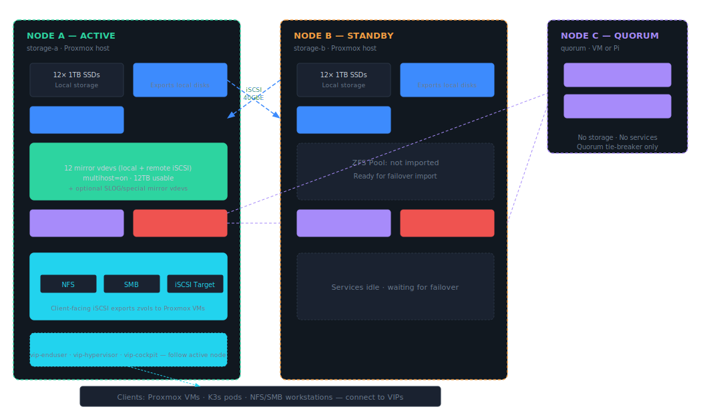
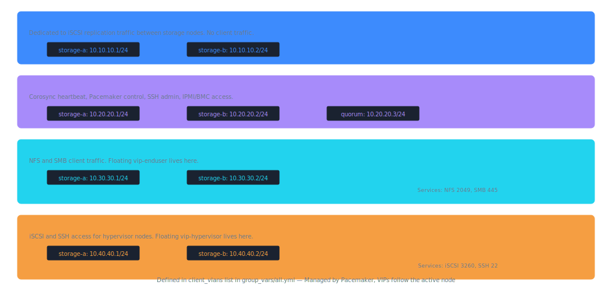
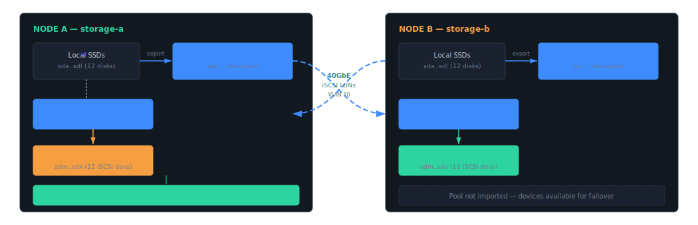
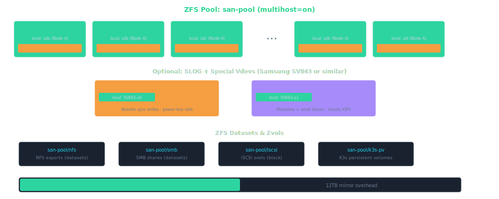
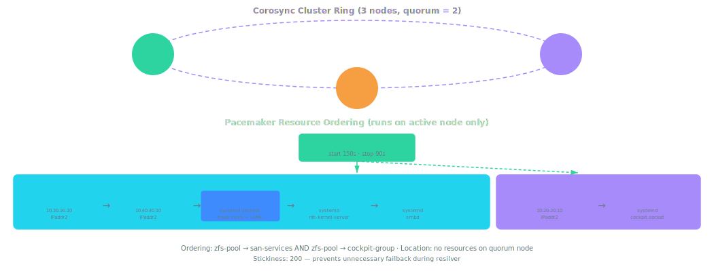
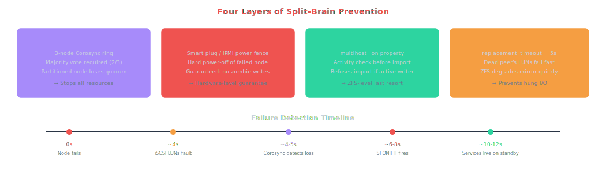
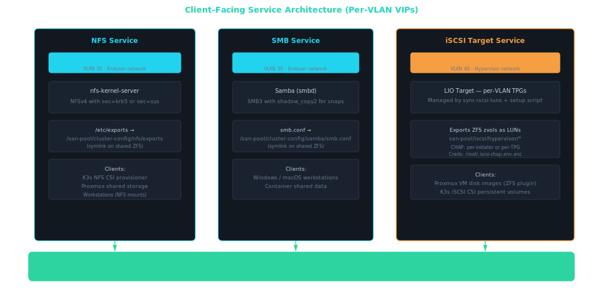
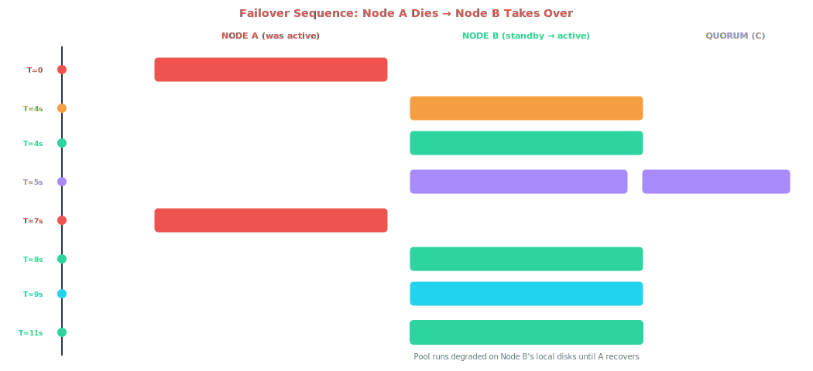
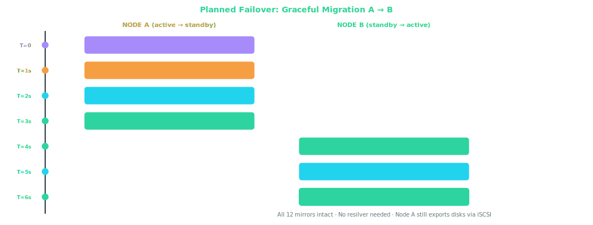
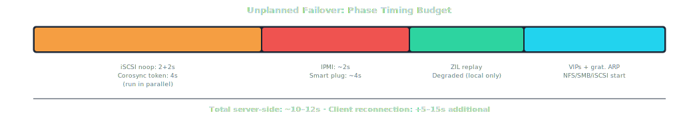

# HA ZFS-over-iSCSI SAN

Two-Node Active/Passive Storage Cluster with Quorum — Architecture Design Document

## Contents

1. [Architecture Overview](#overview)
2. [Network Architecture](#network)
3. [Backend iSCSI Replication Layer](#iscsi-backend)
4. [ZFS Pool Layout](#zfs-pool)
5. [Cluster Stack (Pacemaker / Corosync)](#cluster)
6. [Fencing & Split-Brain Prevention](#fencing)
7. [HA Service Architecture (NFS / SMB / iSCSI)](#services)
8. [Failover Sequences (Unplanned & Planned)](#failover)
9. [Recovery & Resilver](#recovery)
10. [Performance Tuning (Aggressive-Safe Profile)](#tuning)
11. [Reference Configurations](#config)
12. [Operating System & Software Selection](#os)
13. [NVMe-oF / RDMA Future Path](#nvmeof)

---

## 1. Architecture Overview {#overview}

This design builds a highly available SAN from two commodity storage nodes using ZFS mirroring over iSCSI as the replication mechanism. A lightweight third node provides cluster quorum to prevent split-brain without requiring any storage hardware. The cluster presents NFS, SMB, and iSCSI services to clients via floating virtual IPs that follow the active node.

The fundamental pattern: each node exports its local disks as iSCSI targets. Each node also runs an iSCSI initiator that connects to the *other* node's targets. The active node builds a ZFS pool where every mirror vdev contains one local disk and one remote iSCSI LUN, giving you cross-node redundancy with ZFS integrity guarantees on every block.



> **Note:** **Design principle — single writer, always.** Only one node imports the ZFS pool at any time. ZFS `multihost=on` provides last-resort protection, but the real enforcement comes from Pacemaker resource ordering with STONITH fencing. The quorum node guarantees a majority vote (2-of-3) so one surviving storage node can always take authoritative action.

---

## 2. Network Architecture {#network}

Three logically separated networks serve distinct traffic classes. Physical separation of the storage interconnect is strongly recommended — iSCSI is unencrypted and latency-sensitive, so isolation via a dedicated link or non-routable VLAN on your Mellanox SX6036 is the right call.



| Network | VLAN | Subnet | MTU | Speed | Purpose |
|---|---|---|---|---|---|
| Storage Interconnect | 10 | `10.10.10.0/24` | 9000 | 40GbE | iSCSI replication between nodes |
| Management / Cluster | 20 | `10.20.20.0/24` | 1500 | 1–10GbE | Corosync, Pacemaker, SSH, IPMI |
| Enduser / Service | 30 | `10.30.30.0/24` | 9000* | 10–40GbE | NFS/SMB to clients; `vip-enduser` |
| Hypervisor / iSCSI | 40 | `10.40.40.0/24` | 9000* | 10–40GbE | iSCSI/SSH for hypervisors; `vip-hypervisor` |

*Jumbo frames on the client networks depend on whether all clients support MTU 9000. If your Proxmox VMs and K3s nodes are on the same switch fabric with jumbo frame support, enable it. Otherwise, stick with 1500.

Client VLANs are defined in the `client_vlans` list in `group_vars/all.yml`. Per-VLAN firewall rules, VIPs, and iSCSI TPGs are auto-generated from this list.

> **Warning:** **Corosync redundancy.** Best practice is to configure Corosync with two rings — one on the management VLAN and one on the storage interconnect VLAN. This way, a single link failure doesn't cause a false quorum loss. Add both `ring0_addr` and `ring1_addr` in `corosync.conf`.

---

## 3. Backend iSCSI Replication Layer {#iscsi-backend}

The backend iSCSI layer is the foundation of the cross-node mirroring. Each storage node runs two roles simultaneously: an iSCSI **target** (LIO) exporting its local disks, and an iSCSI **initiator** (open-iscsi) connecting to the peer node's targets. This is *not* the same as the client-facing iSCSI service — this is purely for ZFS to access remote disks as if they were local.



### LIO Target Configuration (both nodes)

On Linux (Proxmox/Debian), the kernel iSCSI target is LIO, managed via `targetcli`. Each node creates block backstores for its local disks and exports them in a single target with numbered LUNs.

```bash
# On storage-a — run via targetcli shell or saveconfig.json

# Create backstores (one per local disk)
/backstores/block create disk0 /dev/sda
/backstores/block create disk1 /dev/sdb
# ... repeat for all 12 disks

# Create iSCSI target
/iscsi create iqn.2025-01.lab.home:storage-a

# Create portal on storage interconnect IP only
/iscsi/iqn.2025-01.lab.home:storage-a/tpg1/portals delete 0.0.0.0 3260
/iscsi/iqn.2025-01.lab.home:storage-a/tpg1/portals create 10.10.10.1 3260

# Map LUNs
/iscsi/iqn.2025-01.lab.home:storage-a/tpg1/luns create /backstores/block/disk0 lun0
/iscsi/iqn.2025-01.lab.home:storage-a/tpg1/luns create /backstores/block/disk1 lun1
# ... lun0 through lun11

# CHAP auth (or set attribute authentication=0 for testing)
/iscsi/iqn.2025-01.lab.home:storage-a/tpg1 set attribute authentication=1
/iscsi/iqn.2025-01.lab.home:storage-a/tpg1/acls create iqn.2025-01.lab.home:initiator-b
/iscsi/iqn.2025-01.lab.home:storage-a/tpg1/acls/iqn.2025-01.lab.home:initiator-b set auth userid=iscsiuser password=secretpassword
```

### open-iscsi Initiator Configuration (both nodes)

```ini
# /etc/iscsi/iscsid.conf — key settings
node.startup = automatic
node.session.timeo.replacement_timeout = 5      # Fast failover — don't wait minutes
node.conn[0].timeo.login_timeout = 10
node.conn[0].timeo.noop_out_interval = 2
node.conn[0].timeo.noop_out_timeout = 2
node.session.auth.authmethod = CHAP
node.session.auth.username = iscsiuser
node.session.auth.password = secretpassword

# Discover and log in to peer's targets
# On storage-a:
iscsiadm -m discovery -t sendtargets -p 10.10.10.2:3260
iscsiadm -m node --login

# On storage-b:
iscsiadm -m discovery -t sendtargets -p 10.10.10.1:3260
iscsiadm -m node --login
```

> **Note:** **Critical tunable: `replacement_timeout`.** The default is 120 seconds — far too long. Set it to 5 seconds so that when a peer node dies, iSCSI devices fail quickly rather than hanging all ZFS I/O. ZFS will mark the affected mirror sides as FAULTED and continue operating on local disks in degraded mode. This is the Linux equivalent of the FreeBSD `kern.iscsi.fail_on_disconnection=1` sysctl.

---

## 4. ZFS Pool Layout {#zfs-pool}

Once both nodes can see each other's disks via iSCSI, the active node creates the ZFS pool. Every mirror vdev pairs a local disk with its remote counterpart. With 12 disks per node, you get 12 mirror vdevs = 12TB usable from 24TB raw — exactly 50% efficiency.



### Pool Creation Commands

```bash
# Use stable device paths — by-id for local, by-path for iSCSI
# First, identify your devices and create meaningful symlinks or partlabels

# Label local disks (on each node)
for i in {a..l}; do
  sgdisk -Z /dev/sd${i}
  sgdisk -n1:0:0 -t1:bf01 -c1:"data-a-${i}" /dev/sd${i}
done

# Create pool on active node with cross-node mirrors
zpool create \
  -o multihost=on \
  -o ashift=12 \
  -o autotrim=on \
  -O acltype=posixacl \
  -O compression=lz4 \
  -O dnodesize=auto \
  -O xattr=sa \
  -O atime=off \
  san-pool \
  mirror /dev/disk/by-partlabel/data-a-a /dev/disk/by-path/<iscsi-lun0-from-b> \
  mirror /dev/disk/by-partlabel/data-a-b /dev/disk/by-path/<iscsi-lun1-from-b> \
  mirror /dev/disk/by-partlabel/data-a-c /dev/disk/by-path/<iscsi-lun2-from-b> \
  # ... repeat for all 12 mirror pairs ...
  mirror /dev/disk/by-partlabel/data-a-l /dev/disk/by-path/<iscsi-lun11-from-b>

# Optional: add SLOG mirror
zpool add san-pool log mirror /dev/disk/by-id/<sv843-a-slog> /dev/disk/by-path/<iscsi-sv843-b-slog>

# Optional: add special vdev mirror
zpool add san-pool special mirror /dev/disk/by-id/<sv843-a-meta> /dev/disk/by-path/<iscsi-sv843-b-meta>

# Create datasets for services
zfs create -o sharenfs=on san-pool/nfs
zfs create -o sharesmb=on san-pool/smb
zfs create san-pool/iscsi
zfs create -V 100G -o volblocksize=64k san-pool/iscsi/vm-disk-01
zfs create san-pool/k3s-pv
```

> **Warning:** **SLOG mirroring tradeoff.** Cross-node SLOG mirroring means every sync write traverses the 40GbE link before completing. This adds ~0.1–0.3ms of latency per sync write. For VM workloads this is usually acceptable, but if you need absolute minimum latency, you can keep SLOG local-only on each node — with the understanding that on failover, you lose up to the last few seconds of uncommitted sync writes (the ZIL on the main pool still provides crash consistency for everything that completed).

---

## 5. Cluster Stack (Pacemaker / Corosync) {#cluster}

Pacemaker with Corosync handles all HA orchestration. The three-node cluster guarantees quorum with any single-node failure. Resources are defined so that pool import, service startup, and VIP assignment all happen in the correct order on the active node.



The `san-services` group contains: `vip-enduser` → `vip-hypervisor` → `sync-iscsi-luns` → `nfs-server` → `smb-server`. The separate `cockpit-group` contains `vip-cockpit` → `cockpit-service`. Two ordering constraints apply: `zfs-pool → san-services` and `zfs-pool → cockpit-group`. No resources run on the quorum node.

### Corosync Configuration

```ini
# /etc/corosync/corosync.conf
totem {
    version: 2
    cluster_name: san-cluster
    transport: knet
    crypto_cipher: aes256
    crypto_hash: sha256
    token: 4000            # Aggressive-safe: 4s node death detection
    consensus: 4800        # 1.2× token timeout
    join: 1000
    max_messages: 20
}

nodelist {
    node {
        ring0_addr: 10.20.20.1    # management VLAN
        ring1_addr: 10.10.10.1    # storage VLAN (redundant ring)
        name: storage-a
        nodeid: 1
    }
    node {
        ring0_addr: 10.20.20.2
        ring1_addr: 10.10.10.2
        name: storage-b
        nodeid: 2
    }
    node {
        ring0_addr: 10.20.20.3
        # No ring1 — quorum node has no storage VLAN
        name: quorum
        nodeid: 3
    }
}

quorum {
    provider: corosync_votequorum
    expected_votes: 3
}

logging {
    to_logfile: yes
    logfile: /var/log/corosync/corosync.log
    to_syslog: yes
}
```

### Pacemaker Resource Configuration

```bash
# Configure resources with ordering constraints
# The quorum node is excluded from running any storage resources

# Prevent resources from running on quorum node
pcs property set stonith-enabled=true
pcs constraint location san-services rule score=-INFINITY \#uname eq quorum

# STONITH fencing (smart plug example — adjust for your IPMI/PDU)
pcs stonith create fence-a external/smart-plug \
  ip=smart-plug-a-ip plug=1 \
  pcmk_host_list="storage-a"
pcs stonith create fence-b external/smart-plug \
  ip=smart-plug-b-ip plug=1 \
  pcmk_host_list="storage-b"

# ZFS pool import resource
pcs resource create zfs-pool ocf:heartbeat:ZFS \
  pool="san-pool" \
  op start timeout=150s \
  op stop timeout=90s

# Virtual IPs
pcs resource create vip-enduser ocf:heartbeat:IPaddr2 \
  ip=10.30.30.10 cidr_netmask=24 nic=eth-enduser \
  op monitor interval=10s
pcs resource create vip-hypervisor ocf:heartbeat:IPaddr2 \
  ip=10.40.40.10 cidr_netmask=24 nic=eth-hypervisor \
  op monitor interval=10s
pcs resource create vip-cockpit ocf:heartbeat:IPaddr2 \
  ip=10.20.20.10 cidr_netmask=24 nic=eth-mgmt \
  op monitor interval=10s

# sync-iscsi-luns: auto-maps zvols to LIO LUNs after each pool import
pcs resource create sync-iscsi-luns systemd:sync-iscsi-luns \
  op start timeout=60s op stop timeout=30s

# NFS server
pcs resource create nfs-server systemd:nfs-kernel-server \
  op start timeout=30s op stop timeout=30s

# Samba server
pcs resource create smb-server systemd:smbd \
  op start timeout=30s op stop timeout=30s

# san-services group: VIPs → sync-iscsi-luns → NFS → SMB
pcs resource group add san-services \
  vip-enduser vip-hypervisor sync-iscsi-luns nfs-server smb-server

# cockpit-group: separate from san-services
pcs resource create cockpit-service systemd:cockpit.socket \
  op start timeout=30s op stop timeout=30s
pcs resource group add cockpit-group vip-cockpit cockpit-service

# Ordering constraints
pcs constraint order zfs-pool then san-services
pcs constraint order zfs-pool then cockpit-group

# Prefer node A as primary
pcs constraint location san-services prefers storage-a=100

# Stickiness — prevent unnecessary failback during resilver
pcs resource defaults update resource-stickiness=200
```

---

## 6. Fencing & Split-Brain Prevention {#fencing}

Split-brain is the existential risk in a two-node storage cluster. If both nodes believe they own the pool and write simultaneously, catastrophic data corruption results. This design uses four layers of defense:



> **Important:** **STONITH is mandatory, not optional.** In a two-node storage cluster, "shoot the other node in the head" is the only way to guarantee a failed node isn't still writing to shared storage. Without STONITH, Pacemaker will refuse to fail over resources. Smart plug fencing works — just make sure the plug is on a separate network/power path from the storage nodes.

---

## 7. HA Service Architecture (NFS / SMB / iSCSI) {#services}

All storage protocols run on the active node and bind to their respective floating VIPs. Clients connect exclusively to VIPs, never to node-specific IPs, so failover is transparent.



> **Note:** **Two separate LIO instances.** Note that the *backend* iSCSI target (exporting raw disks for cross-node mirroring) and the *client-facing* iSCSI target (exporting zvols to Proxmox VMs) are logically separate. The backend target runs on **both** nodes permanently on the storage interconnect VLAN. The client-facing target is managed by `sync-iscsi-luns` and `setup-client-iscsi-target.sh` and only runs on the active node, bound to the client VIP. Use separate IQN namespaces and portal groups to keep them cleanly separated.

### NFS Configuration

NFS binds to `vip-enduser` (10.30.30.10) on VLAN 30. The exports file is symlinked to shared ZFS storage so configuration is identical on both nodes after failover.

```bash
# /etc/exports is a symlink → /san-pool/cluster-config/nfs/exports
# Edit the shared storage location, not the local path
/san-pool/nfs    10.30.30.0/24(rw,sync,no_subtree_check,root_squash)
/san-pool/k3s-pv 10.30.30.0/24(rw,sync,no_subtree_check,root_squash)

# /etc/nfs.conf — bind to VIP only
[nfsd]
host = 10.30.30.10
threads = 8
vers4 = y
vers4.1 = y
```

### Samba Configuration

SMB binds to `vip-enduser` (10.30.30.10) on VLAN 30. The smb.conf is symlinked to shared ZFS storage.

```ini
# /etc/samba/smb.conf is a symlink → /san-pool/cluster-config/samba/smb.conf
# Edit the shared storage location, not the local path
[global]
    interfaces = 10.30.30.10
    bind interfaces only = yes
    server string = HA SAN SMB
    vfs objects = shadow_copy2    # Exposes ZFS snapshots as Previous Versions
    shadow:snapdir = .zfs/snapshot
    shadow:sort = desc
    shadow:format = %Y-%m-%d-%H%M%S

[shared]
    path = /san-pool/smb
    read only = no
    valid users = @smbusers
```

### Client-Facing iSCSI Target (Per-VLAN TPG Isolation)

Each iSCSI-enabled client VLAN gets its own LIO TPG. TPGs are numbered by `loop.index` in the `client_vlans` list. iSCSI portals are bound to per-VLAN VIPs (requires `ip_nonlocal_bind=1`).

**Two TPG modes:**

- **ACL mode** (default): `iscsi_acls` entries in `client_vlans`. Entries can be plain IQN strings (no CHAP) or dicts with `{iqn, chap_user, chap_password}` for per-initiator CHAP.
- **`generate_node_acls: true`**: Sets `generate_node_acls=1` and `demo_mode_write_protect=0` on the TPG. Required for the Proxmox ZFS-over-iSCSI plugin (which does not support per-IQN ACLs). Individual ACL entries are not created. Per-TPG CHAP is configured with `iscsi_chap_user` + `iscsi_chap_password` at the VLAN level — all initiators share one credential.

**CHAP is implicit** — no toggle needed. Credentials present = `authentication=1`; no credentials = `authentication=0`.

**Encrypted credentials:** CHAP passwords are never stored in plaintext on disk. Ansible deploys `/root/.iscsi-chap.env.enc` (mode 0600, encrypted with OpenSSL AES-256-CBC using `/etc/machine-id` as the passphrase). Both `setup-client-iscsi-target.sh` and `sync-iscsi-luns.sh` decrypt at runtime via `eval "$(openssl enc -d ...)"`.

**Backstore naming:** Single-VLAN deployments use `<zvol>` as the backstore name (unchanged). Multi-VLAN deployments use `<vlan>-<zvol>` to prevent VMID collisions across VLANs.

**LUN auto-sync:** The `sync-iscsi-luns` Pacemaker resource runs after each pool import. It auto-discovers zvols per the VLAN's `iscsi_dataset`, maps them as LIO LUNs per-TPG, and syncs ACL files from `/san-pool/cluster-config/iscsi/acls-<vlan-name>.conf`. Phase 0 bakes in the TPG→dataset/VLAN mapping at deploy time — no runtime file dependency.

**Password rotation:** Re-run `ansible-playbook ... --tags services` to deploy a new encrypted credentials file, then the idempotent setup script re-applies CHAP settings.

Example `client_vlans` entry in `group_vars/all.yml`:

```yaml
client_vlans:
  - name: enduser
    id: 30
    subnet: 10.30.30.0/24
    vip: 10.30.30.10
    services: [nfs, smb]

  - name: hypervisor
    id: 40
    subnet: 10.40.40.0/24
    vip: 10.40.40.10
    services: [iscsi, ssh]
    generate_node_acls: true          # Proxmox ZFS-over-iSCSI plugin
    iscsi_chap_user: "proxmox-shared" # Per-TPG CHAP (all initiators share)
    iscsi_chap_password: !vault |...
    iscsi_dataset: "iscsi/hypervisor"
```

---

## 8. Failover Sequences (Unplanned & Planned) {#failover}

### Scenario: Active Node (A) Fails



> **Key insight:** **The pool was already there.** In the active/passive model, the pool is imported on whichever node Pacemaker designates. If the standby node takes over, it already has its iSCSI initiator connected and its local disks ready. The import is fast because ZFS only needs to replay the ZIL and the local halves of all mirrors are immediately available. The remote halves (from the dead node) are simply FAULTED until recovery.

### Scenario: Standby Node (B) Fails

This is the simpler case. When the standby node dies, the active node's iSCSI sessions to Node B timeout after ~5 seconds. ZFS marks the remote halves of all mirrors as FAULTED and continues operating in degraded mode on local disks only. No pool export/import is needed, no VIP migration, no service interruption. Clients experience zero downtime — they may notice slightly different latency characteristics since writes are only going to local disks until B recovers.

### Scenario: Network Partition (A and B lose connectivity to each other)

This is the scenario the quorum node exists to resolve. If A and B can't talk to each other but both are healthy, the quorum node's vote determines which side has majority. The node that maintains communication with the quorum node keeps quorum and continues operating. The node that loses quorum gracefully shuts down its resources (exports the pool, stops services, releases VIPs). STONITH fires against the partitioned node as a safety measure.

### Scenario: Planned Failover (Maintenance)

Planned failover is fundamentally different from a crash scenario: faster, cleaner, and no resilver needed. The pool is cleanly exported on Node A before Node B imports it — all 12 mirror vdevs are fully synced at the moment of handoff because A flushed all pending writes and committed the final transaction group before releasing the pool.



The critical difference: after a planned failover, Node A is still running and its LIO target is still exporting disks. Node B can see all 24 block devices — 12 local + 12 remote via iSCSI from A — so the pool is fully healthy immediately. No STONITH fires, no resilver, no degraded operation.

```bash
# Planned failover: put Node A in standby (Pacemaker migrates all resources)
pcs node standby storage-a

# ... do maintenance work ...

# Bring Node A back into the cluster
pcs node unstandby storage-a

# Note: pacemaker-node-standby.service handles standby/unstandby automatically
# during shutdown/boot — a clean reboot also triggers a planned failover
```

### Timing Comparison: Unplanned vs. Planned

| Phase | Unplanned (crash) | Planned (graceful) |
|---|---|---|
| Detection | ~4–5s (iSCSI timeout + Corosync) | 0s (admin-initiated) |
| STONITH | ~2–4s (must confirm kill) | Not needed |
| Pool transition | ~2–3s (ZIL replay, degraded import) | ~1–2s (clean export → clean import) |
| Service startup | ~1–2s | ~1–2s |
| **Server-side total** | **~10–12s** | **~5–8s** |
| Pool health after | DEGRADED — resilver needed | ONLINE — fully healthy |
| Client reconnection | 5–30s (varies by protocol) | 3–10s (cleaner reconnection) |

---

## 9. Recovery & Resilver {#recovery}

1. **Failed node comes back online.** After repair or power restoration, the node boots normally. Its iSCSI target starts, re-exporting its local disks.
2. **iSCSI sessions reconnect.** The active node's open-iscsi initiator detects the peer's targets are available again and re-establishes sessions. The previously-faulted iSCSI LUNs reappear as block devices.
3. **ZFS automatically resilvers.** With `zfs_autoreplace=on` or manual intervention, ZFS begins resilvering the mirrors — syncing all changed blocks from the active (local) side to the recovered (remote) side. Sequential resilver is efficient on SSDs.
4. **Pool returns to healthy state.** Once resilver completes, all 12 mirrors are fully redundant again. You can optionally fail back to the original primary node via `pcs node standby` on the current active node.

```bash
# Monitor resilver progress
zpool status san-pool
# Example output during resilver:
#   scan: resilver in progress, 45.2% done, 00:12:30 to go
#   mirror-0  DEGRADED
#     sda     ONLINE
#     iscsi-b-lun0  ONLINE (resilvering)

# Force a failback after recovery (optional)
# Put Node B in standby — resources migrate back to Node A (preferred node)
pcs node standby storage-b
# Wait for resources to migrate cleanly, then bring Node B back
pcs node unstandby storage-b
```

---

## 10. Performance Tuning (Aggressive-Safe Profile) {#tuning}

These tunables target the **aggressive-safe** failover profile: ~10–12 second unplanned failover, ~5–8 second planned failover, with minimal risk of false positives from transient network events.

#### Corosync Aggressive-Safe Tunables

```ini
# In corosync.conf totem {} section
# Default token is 10000ms — too slow
token: 4000          # 4s to declare node dead
consensus: 4800     # 1.2× token
join: 1000
max_messages: 20

# Below 3000ms for token risks false
# quorum loss from network jitter
```

#### iSCSI Aggressive-Safe Tunables

```ini
# /etc/iscsi/iscsid.conf
node.session.timeo.replacement_timeout = 5
node.conn[0].timeo.noop_out_interval = 2
node.conn[0].timeo.noop_out_timeout = 2
node.conn[0].timeo.login_timeout = 10
node.startup = automatic

# Total detection: ~4s (2+2)
# LUN fault: ~5s after peer death
```

#### ZFS Tunables

```bash
# /etc/modprobe.d/zfs.conf

# ARC limit: set dynamically to 50% of RAM at deploy time
# Override per-host: host_vars/<node>.yml  zfs_arc_max: 17179869184

# Tune for SSD workloads
options zfs zfs_vdev_scheduler=none
options zfs zfs_txg_timeout=30      # Default; sync writes unaffected

# Speed up resilver
options zfs zfs_resilver_min_time_ms=27000  # 27s minimum (OpenZFS recommended)
options zfs zfs_resilver_delay=0

# Trust SSD flush — safe with enterprise SSDs (hardware PLP)
options zfs zfs_nocacheflush=1
```

#### Network / TCP Tunables

```bash
# Jumbo frames on storage interconnect
ip link set ens-storage mtu 9000

# TCP tuning for 40GbE iSCSI
sysctl -w net.core.rmem_max=16777216
sysctl -w net.core.wmem_max=16777216
sysctl -w net.ipv4.tcp_rmem="4096 87380 16777216"
sysctl -w net.ipv4.tcp_wmem="4096 65536 16777216"
```

### Failover Timing Breakdown (Aggressive-Safe)



### Resource Stickiness

```bash
# Prevent unnecessary failback after recovery — let the pool resilver first
pcs resource defaults update resource-stickiness=200
```

> **Note:** **SLOG latency vs. network latency.** With cross-node SLOG mirroring, every sync write must cross the 40GbE link. At 40Gbps with jumbo frames, you're looking at ~0.1ms additional latency per sync write. For NFS (which defaults to sync) and iSCSI VM workloads, this is generally fine. For write-heavy SMB workloads, consider Samba's `aio write size` and `strict sync` settings to batch writes.

---

## 11. Reference Configurations {#config}

### Complete Component Checklist

| Component | Node A | Node B | Quorum (C) |
|---|---|---|---|
| iSCSI Target (backend) | ALWAYS ON — exports local disks on 10.10.10.1 | ALWAYS ON — exports local disks on 10.10.10.2 | — |
| iSCSI Initiator (backend) | ALWAYS ON — connects to B's targets | ALWAYS ON — connects to A's targets | — |
| Corosync / Pacemaker | ALWAYS ON | ALWAYS ON | ALWAYS ON |
| ZFS pool import | ACTIVE or STANDBY | STANDBY or ACTIVE | — |
| NFS server | `vip-enduser` 10.30.30.10 — follows pool | | — |
| SMB server | `vip-enduser` 10.30.30.10 — follows pool | | — |
| iSCSI Target (client) | `vip-hypervisor` 10.40.40.10 — follows pool | | — |
| sync-iscsi-luns | Pacemaker resource — follows pool, maps zvols to LIO LUNs | | — |
| cockpit-group | `vip-cockpit` + `cockpit-service` — follows pool | | — |
| STONITH agent | Can fence B | Can fence A | Can fence A or B |

### Installation Summary (Debian/Ubuntu/Rocky)

```bash
# All three nodes
apt install pacemaker corosync pcs           # Debian/Ubuntu
dnf install pacemaker corosync pcs           # Rocky/AlmaLinux

# Storage nodes only (A and B)
apt install targetcli-fb open-iscsi zfsutils-linux nfs-kernel-server samba
dnf install targetcli python3-rtslib open-iscsi zfs nfs-utils samba

# Enable backend iSCSI services (always running, NOT managed by Pacemaker)
systemctl enable --now rtslib-fb-targetctl    # LIO target persistence
systemctl enable --now iscsid open-iscsi      # iSCSI initiator

# Disable services that Pacemaker will manage
systemctl disable nfs-kernel-server smbd

# Initialize Pacemaker cluster
pcs cluster auth storage-a storage-b quorum -u hacluster -p <password>
pcs cluster setup san-cluster storage-a storage-b quorum
pcs cluster start --all
pcs cluster enable --all
```

> **Warning:** **Important distinction: what Pacemaker manages vs. what runs independently.** The backend iSCSI targets and initiators run as normal systemd services on both storage nodes — they must be available at all times so that whichever node imports the pool can reach the other's disks. Only the ZFS pool import, VIPs, NFS, SMB, `sync-iscsi-luns`, and cockpit resources are Pacemaker-managed and float between nodes.

---

## 12. Operating System & Software Selection {#os}

### OS: Debian 12 (Bookworm)

For dedicated storage nodes, Debian 12 provides the cleanest foundation: minimal attack surface, proven ZFS DKMS support (it's the base for both Proxmox and TrueNAS Scale), all clustering components from standard repos, and complete control over what's running. Rocky Linux 9 is the runner-up if you prefer RHEL ecosystem tooling and the best-documented Pacemaker guides. AlmaLinux 9 is binary-compatible with Rocky Linux 9 and uses the same `RedHat.yml` vars unchanged. Ubuntu 22.04 and 24.04 are both supported with native ZFS packages.

| Criteria | Debian 12 | Proxmox VE 8 | Rocky 9 / AlmaLinux 9 | Ubuntu 22.04/24.04 |
|---|---|---|---|---|
| ZFS | DKMS via contrib | BUILT-IN | DKMS via ZoL repo | PACKAGE |
| Pacemaker | YES | CONFLICTS w/ PVE HA | YES (best docs) | YES |
| Mellanox OFED | YES | COMPAT ISSUES | BEST | YES |
| Overhead | MINIMAL | PVE STACK | MINIMAL | SNAP overhead |

### Prebuilt NAS Software

**TrueNAS Scale — Not viable.** Community Edition HA requires Enterprise hardware (PCIe NTB, dual-port SAS). The locked-down OS fights custom Pacemaker clusters. Good as a single-node NAS, wrong for this architecture.

**RSF-1 — Viable but proprietary.** Purpose-built for ZFS HA clustering with a web GUI. However, it replaces Pacemaker with its own stack, limiting tuning and teaching non-transferable skills. Paid licensing.

**45Drives Houston — Recommended as a management layer.** Open-source Cockpit plugins for NFS, SMB, iSCSI, ZFS, and Pacemaker visualization. Install on top of Debian + Pacemaker for a web UI without sacrificing control. Non-intrusive — the plugins wrap standard Linux tools.

> **Key insight:** **Recommended stack:** Debian 12 minimal → Pacemaker/Corosync + LIO + open-iscsi (configured manually) → 45Drives Houston Cockpit plugins (for day-to-day management UI). You learn industry-standard clustering tools while still getting a usable dashboard.

---

## 13. NVMe-oF / RDMA Future Path {#nvmeof}

NVMe over Fabrics is the eventual replacement for iSCSI in this architecture, but the current hardware and ecosystem maturity make iSCSI the right choice for the initial build.

### Why Not Now

| Blocker | Detail |
|---|---|
| SATA disks behind HBAs | NVMe-oF's advantage is eliminating SCSI translation. With SATA SSDs, the NVMe target translates NVMe→SCSI/ATA commands — adding overhead rather than removing it. Latency benefit disappears. |
| ConnectX-3 RDMA limitations | CX-3 supports RoCE v1 (single L2 domain only) and IB RDMA. RoCE v2 (works across VLANs) requires CX-4+. IB mode means abandoning Ethernet topology entirely. |
| No Pacemaker resource agent | iSCSI has mature `ocf:heartbeat:iscsi` agents. NVMe-oF has no standard Pacemaker RA — you'd write custom scripts for failover, adding bug surface in the HA stack. |
| Immature failure detection | iSCSI has well-tested `replacement_timeout` + `noop_out_*` tunables. NVMe/TCP's `ctrl_loss_tmo` / `keep_alive_tmo` have less HA-specific tuning guidance. Known kernel bugs with connection establishment under memory pressure (as of early 2025). |
| Authentication tooling | NVMe-oF DH-HMAC-CHAP is cryptographically stronger than iSCSI CHAP (HMAC-SHA-256 vs MD5), but nvmetcli tooling for key management is less polished than LIO's CHAP integration. |

### When to Upgrade

NVMe-oF becomes the right choice when: you upgrade to NVMe drives (U.2/M.2) eliminating SCSI translation, ConnectX-4 cards are installed enabling RoCE v2 or NVMe/RDMA, and Pacemaker resource agents for NVMe-oF targets mature (active development in LINBIT and Proxmox communities). NVMe/TCP over standard Ethernet with CX-4 cards is the pragmatic stepping stone — NVMe/RDMA via RoCE v2 is the performance target (sub-100μs interconnect latency).

> **Note:** **The architecture doesn't change.** Swapping iSCSI for NVMe/TCP is a contained change: replace LIO + open-iscsi with nvmet + nvme-cli, update device paths from `/dev/disk/by-path/ip-*-iscsi-*` to `/dev/disk/by-path/ip-*-nvme-*`, and recreate the pool. The ZFS pool layout, Pacemaker resource ordering, fencing, VIPs, and service configuration all remain identical.
