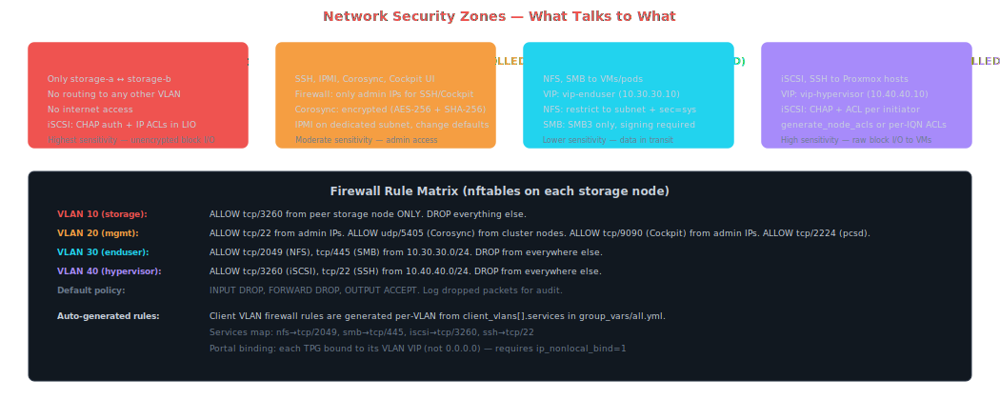

# HA SAN — OS, Best Practices & Hardening

Operating System Selection · Prebuilt NAS Software Evaluation · Storage Best Practices · Security Hardening

## Contents

1. [Operating System & Software Selection](#os)
2. [Prebuilt NAS Software Evaluation](#prebuilt)
3. [Storage Server Best Practices](#best)
4. [Security Hardening](#security)
5. [Planned & Unplanned Failover Operations](#failover-ops)
6. [NVMe-oF / RDMA Evaluation](#nvmeof)
7. [Deployment Checklist](#checklist)

---

## 1. Operating System & Software Selection {#os}

The OS choice for a ZFS-over-iSCSI HA SAN is driven by a specific set of requirements: rock-solid ZFS support, mature iSCSI target/initiator stacks (LIO + open-iscsi), Pacemaker/Corosync clustering, and long-term stability. Not every Linux distribution handles all of these equally well.

### Candidate Comparison

| Criteria | Debian 12 (Bookworm) | Proxmox VE 8.x | Rocky Linux 9 | AlmaLinux 9 | Ubuntu Server 22.04/24.04 |
|---|---|---|---|---|---|
| ZFS support | DKMS via contrib | BUILT-IN first-class | DKMS via ZFS repo | DKMS via ZFS repo | BUILT-IN via package |
| LIO iSCSI target | YES — targetcli-fb | YES — targetcli-fb | YES — targetcli | YES — targetcli | YES — targetcli-fb |
| Pacemaker/Corosync | YES | MANUAL — parallel to PVE HA | YES — Red Hat HA add-on | YES — Red Hat HA add-on | YES |
| Kernel lifecycle | 5.x→6.x via backports, 5yr | 6.x, tracks Debian + patches | 5.14 base + ELRepo, 10yr | 5.14 base + ELRepo, 10yr | 6.x HWE, 5yr / 12yr ESM |
| Mellanox drivers | MLNX_OFED | COMPAT — issues w/ PVE kernels | MLNX_OFED — best support | MLNX_OFED — best support | MLNX_OFED |
| Package freshness | Stable, slightly behind | Proxmox repos add currency | Conservative (by design) | Conservative (by design) | Freshest of the group |
| Overhead / bloat | MINIMAL | PVE STACK included | MINIMAL | MINIMAL | SNAP subsystem |
| Community + docs for HA storage | Good, but less specific | Extensive PVE community | Best (RHEL HA docs excellent) | Best (uses RedHat.yml unchanged) | Good general docs |

### Analysis

#### Debian 12 — The clean foundation

Debian is the strongest candidate for dedicated storage nodes that won't run VMs. It's the base for both Proxmox and TrueNAS Scale, meaning the ecosystem is proven for storage workloads. You get a minimal install with no unnecessary services, ZFS via the contrib repo (well-maintained DKMS modules), and all the clustering components from standard repos. The downside is that you're managing everything from the command line — no web UI for storage management out of the box. For your use case of learning infrastructure-as-code, that's actually a benefit.

#### Proxmox VE 8.x — If the storage nodes double as compute

If you want these storage nodes to also run VMs or containers (which you might, given your two-node Proxmox cluster), Proxmox gives you ZFS as a first-class citizen plus the entire virtualization stack. The catch is that Proxmox has its own HA system (corosync + pmxcfs) which will conflict with a separate Pacemaker cluster for storage HA. You'd need to either use Proxmox's built-in HA (which doesn't natively understand ZFS-over-iSCSI failover), or run Pacemaker alongside it very carefully. MLNX_OFED driver compatibility with Proxmox's patched kernels has also been a sore point — you've already run into this on Proxmox 9.

#### Rocky Linux 9 — Enterprise HA pedigree

Rocky (and RHEL/Alma) has the best-documented Pacemaker clustering story of any Linux distribution. The RHEL High Availability Add-On documentation is genuinely excellent and covers ZFS HA scenarios thoroughly — the ewwhite/zfs-ha wiki on GitHub was built entirely on CentOS/RHEL. MLNX_OFED support is strongest on RHEL-family distros. The tradeoff is that ZFS isn't native — it comes from the ZFS on Linux repo and is DKMS-based, which means kernel updates require rebuild cycles. The 5.14 base kernel is also quite old, though ELRepo provides newer kernels if needed.

#### AlmaLinux 9 — Binary-compatible Rocky alternative

AlmaLinux 9 is binary-compatible with Rocky Linux 9 and uses the same `RedHat.yml` vars and task files unchanged in this playbook. All of the Rocky Linux 9 notes above apply equally to AlmaLinux 9. It is a valid drop-in alternative if you prefer the AlmaLinux project or community.

#### Ubuntu Server 22.04 / 24.04 LTS — Balanced

Ubuntu ships ZFS as a supported package (including root-on-ZFS in the installer), has current kernels via HWE, and all the clustering components are readily available. Both Ubuntu 22.04 and 24.04 LTS are supported — Ubuntu 22.04-specific values are overlaid where they differ from 24.04. The snap subsystem adds some overhead and complexity you don't need on a storage server. Ubuntu's ZFS integration is solid but occasionally lags behind upstream — Canonical patches ZFS to match their kernel versions rather than tracking OpenZFS HEAD.

> **Key insight:** For nodes whose sole purpose is HA SAN duties, Debian 12 gives you the cleanest foundation with the least baggage. You get a minimal attack surface, proven ZFS DKMS support, all the clustering components you need, and complete control over what's running. It's the same base as Proxmox and TrueNAS Scale, so the kernel/driver ecosystem is battle-tested for storage workloads.
>
> If these nodes will also serve as Proxmox compute hosts, use Proxmox VE but plan to use its native HA stack (or accept the complexity of running Pacemaker alongside it). If you prefer the strongest HA documentation and are comfortable with the RHEL ecosystem, Rocky 9 or AlmaLinux 9 is the second-best choice.

---

## 2. Prebuilt NAS Software Evaluation {#prebuilt}

The appeal of prebuilt NAS software is obvious: someone else has already solved the integration problems. But for this specific architecture — ZFS mirroring over iSCSI with Pacemaker failover — most prebuilt solutions either can't do what you need, or they introduce constraints that fight your design.

### TrueNAS Scale

**Strengths**

Excellent ZFS management GUI with dataset/zvol creation, snapshot management, and monitoring. Built-in iSCSI target (via LIO), NFS, and SMB configuration. Active community and extensive documentation. Debian-based, so the underlying OS is familiar.

**Blockers for this design**

HA clustering in Community Edition is effectively nonexistent. TrueNAS's Gluster-based clustering was deprecated and removed. Native two-node HA (the kind iXsystems sells on M-Series/X-Series hardware) requires their Enterprise appliances with PCIe Non-Transparent Bridging and dual-port SAS — hardware you don't have. TrueNAS locks down the OS significantly — installing Pacemaker, running custom systemd services, and managing LIO outside of the TrueNAS API all fight the system. Upgrades can overwrite custom configurations. You'd essentially be fighting TrueNAS to implement your architecture.

> **Important:** **TrueNAS Scale verdict: Not viable for this architecture.** TrueNAS is excellent as a single-node NAS, but its HA story requires either their proprietary Enterprise hardware or RSF-1 as a third-party add-on. The Community Edition's locked-down OS model conflicts directly with running a custom Pacemaker/Corosync cluster. You'd spend more time working around TrueNAS than benefiting from it.

### RSF-1 (High-Availability.com)

**Strengths**

Purpose-built for ZFS HA clustering. Supports active-active with multiple pools. Has a web GUI for cluster management. Works with TrueNAS (Core and Scale), Proxmox, bare Linux, and even Solaris/BSD. Handles iSCSI target failover, NFS, SMB, and ZFS pool export/import automatically. Uses SCSI reservations for fencing in addition to network heartbeats. Proven product with a long history — many production deployments. Integrates directly with Proxmox's ZFS-over-iSCSI storage backend.

**Considerations**

Commercial product with paid licensing — pricing isn't published, but reportedly reasonable for small deployments. Uses its own clustering stack rather than standard Pacemaker/Corosync, which limits your tuning ability (as noted in the Proxmox forum thread about it). You're locked into their failover logic and can't customize timeout behaviors as granularly. The skills you learn are RSF-1-specific rather than transferable Pacemaker/Corosync knowledge. 45-day trial available for evaluation.

> **Warning:** **RSF-1 verdict: Viable but trades learning for convenience.** If you want a turnkey HA solution and are willing to pay licensing, RSF-1 is the most mature product for ZFS HA clustering. It handles the hard parts (fencing, pool failover, iSCSI target migration) out of the box. However, it replaces Pacemaker with its own stack, which means you're learning a proprietary tool rather than industry-standard clustering. For a career-building homelab focused on cloud infrastructure skills, the DIY Pacemaker route teaches you more transferable knowledge.

### 45Drives Houston (Cockpit Plugins)

**Strengths**

Open source Cockpit plugins — free to use, no licensing. Modules for NFS, SMB, iSCSI, ZFS management, and Pacemaker cluster visualization. Built on standard Linux tools (the modules are essentially GUI wrappers around targetcli, Samba, NFS exports, and pcs commands). Designed for exactly this kind of architecture — their iSCSI module explicitly simplifies LIO target/initiator configuration for clustering. Non-intrusive — these are Cockpit plugins that sit on top of your OS, not a replacement for it.

**Considerations**

Designed primarily for 45Drives hardware (Storinators), though the plugins work on any Linux system. The clustering modules are more of a visualization/management layer than a full HA orchestration platform — you still need to understand and configure Pacemaker/Corosync yourself. Documentation is good but assumes you're using their hardware in some places. Some modules are more polished than others — the iSCSI and file sharing modules are strong, but cluster management is still relatively new.

> **Key insight:** **45Drives Houston verdict: Use it — as a management layer on top of Debian + Pacemaker.** This is the best fit for your goals. Install Debian 12 as the base, configure Pacemaker/Corosync and all the storage services manually (learning the internals), then layer the Houston Cockpit plugins on top for day-to-day management and monitoring. You get a proper web UI for managing NFS exports, SMB shares, iSCSI targets, and ZFS datasets without sacrificing any control over the underlying system. The plugins are open source, so when they don't do exactly what you need, you can read the code and extend them.

### Summary Matrix

| Feature | TrueNAS Scale | RSF-1 | 45Drives Houston | DIY (Debian + Pacemaker) |
|---|---|---|---|---|
| ZFS-over-iSCSI HA | NO | YES | MGMT ONLY | YES |
| Pacemaker/Corosync | NO | OWN STACK | WRAPS PCS | NATIVE |
| Web GUI | EXCELLENT | GOOD | GOOD | NONE |
| Cost | FREE | PAID | FREE | FREE |
| Transferable skills | ZFS, Debian | ZFS, RSF-1 only | ZFS, Linux, Pacemaker | ZFS, Linux, Pacemaker |
| Fits your architecture | NO | YES | YES | YES |

---

## 3. Storage Server Best Practices {#best}

### ZFS Configuration

#### Dataset design

Keep your dataset hierarchy flat and purpose-driven. Each service gets its own top-level dataset with tuned properties. Don't nest more than 2–3 levels deep — every dataset adds to pool import time, and with HA failover, import speed matters. Use separate datasets rather than separate pools for isolation; you only want one pool to manage for failover purposes.

```bash
# Dataset hierarchy — flat, purpose-driven
san-pool/nfs/media          recordsize=1M, compression=lz4
san-pool/nfs/home           recordsize=128k, compression=zstd
san-pool/smb/shared         recordsize=128k, compression=lz4
san-pool/iscsi/vm-proxmox-a volblocksize=64k
san-pool/iscsi/vm-proxmox-b volblocksize=64k
san-pool/k3s-pv/default     recordsize=128k, compression=lz4

# Key properties for storage server use
zfs set primarycache=metadata san-pool/iscsi  # Let VM guests manage their own caching
zfs set sync=standard san-pool                # With SLOG, sync writes are fast
zfs set snapdir=visible san-pool/smb          # For shadow_copy2 / Previous Versions
```

#### Snapshot strategy

Automated snapshots are essential, but keep the count bounded — hundreds of snapshots per dataset measurably slow pool import and `zfs send` operations. For HA storage, import speed directly impacts failover time. Use a tool like `sanoid` with aggressive pruning.

```ini
# /etc/sanoid/sanoid.conf
[san-pool/nfs]
  use_template = production
  recursive = yes

[san-pool/smb]
  use_template = production
  recursive = yes

[san-pool/iscsi]
  use_template = vm-storage
  recursive = yes

[template_production]
  hourly = 24
  daily = 30
  monthly = 6
  yearly = 0
  autosnap = yes
  autoprune = yes

[template_vm-storage]
  hourly = 12       # Fewer snapshots — zvols are expensive to snapshot
  daily = 14
  monthly = 3
  yearly = 0
  autosnap = yes
  autoprune = yes
```

#### Scrub scheduling

Monthly scrubs are standard. On an HA SAN, schedule scrubs during low-activity windows and stagger them so a scrub doesn't coincide with heavy resilver activity after a node recovery. ZFS scrubs on SSDs are fast (12TB of mirrors should complete in under an hour) but still generate cross-node iSCSI traffic that increases latency.

### iSCSI Best Practices

#### Stable device naming

This is critical and easy to get wrong. iSCSI LUNs appear as `/dev/sd*` devices with non-deterministic naming across reboots. Always reference them by stable paths: `/dev/disk/by-path/` for iSCSI devices and `/dev/disk/by-id/` or `/dev/disk/by-partlabel/` for local disks. The ZFS pool will store these paths in its configuration — if they change, the pool can't import cleanly.

```bash
# Find stable paths for iSCSI devices
ls -la /dev/disk/by-path/ | grep iscsi

# Example output:
# ip-10.10.10.2:3260-iscsi-iqn.2025-01.lab.home:storage-b-lun-0 -> ../../sdm
# ip-10.10.10.2:3260-iscsi-iqn.2025-01.lab.home:storage-b-lun-1 -> ../../sdn

# Use these paths in zpool create, not /dev/sdX
```

#### Separate backend and client-facing targets

This bears repeating: the backend iSCSI targets (exporting raw disks for cross-node ZFS mirroring) and the client-facing iSCSI targets (exporting zvols to Proxmox VMs) must be completely separate. Different IQN namespaces, different portal groups, different network interfaces. The backend targets run permanently on both nodes as systemd services. The client-facing target is a Pacemaker resource that only runs on the active node.

### Cluster Management

#### Resource stickiness

Set a default resource stickiness value to prevent unnecessary failback. Without stickiness, when a recovered node rejoins the cluster, Pacemaker may move all resources back to the "preferred" node. This causes an unnecessary service interruption for a second failover. Let the pool resilver on the current active node, then manually fail back during a maintenance window.

```bash
# Set stickiness so resources don't automatically move back
pcs resource defaults update resource-stickiness=200

# Manual failback when ready: put current active node in standby
# Resources migrate back to Node A (preferred node)
pcs node standby storage-b
# Wait for resources to stabilize, then bring Node B back
pcs node unstandby storage-b
```

#### Monitoring

Set up monitoring for pool health, resilver progress, iSCSI session state, and cluster status. Pacemaker's `crm_mon` gives you real-time cluster state. For external monitoring, export metrics via `node_exporter` with the ZFS collector enabled, and use Prometheus + Grafana (which you can run on your K3s cluster).

---

## 4. Security Hardening {#security}

A storage server is one of the highest-value targets in any infrastructure — it holds everyone's data. The attack surface of an HA SAN includes the storage protocols themselves (iSCSI, NFS, SMB), the cluster management plane, the OS, and physical access to the hardware.

### Network-Level Security



#### VLAN isolation is your primary defense

iSCSI traffic is unencrypted and unauthenticated at the wire level (CHAP only protects session establishment, not data in transit). The storage interconnect VLAN must be completely isolated — no routing to any other network, no internet access, ideally on a physically separate switch or dedicated ports on your SX6036. On the Mellanox switch, configure the storage VLAN as an isolated VLAN with no default gateway.

#### nftables firewall on every node

Even with VLAN isolation, run host-based firewalls. Defense in depth means a misconfigured switch port doesn't expose raw iSCSI to your home network.

Client VLAN firewall rules are auto-generated per-VLAN from `client_vlans[].services` in `group_vars/all.yml`. Two client VLANs are configured: enduser VLAN 30 (NFS/SMB) and hypervisor VLAN 40 (iSCSI/SSH).

```bash
# /etc/nftables.conf — storage node firewall skeleton
#!/usr/sbin/nft -f
flush ruleset

table inet filter {
  chain input {
    type filter hook input priority 0; policy drop;

    # Loopback and established
    iif lo accept
    ct state established,related accept

    # VLAN 10 (storage) — iSCSI from peer only
    iifname "vlan10" ip saddr 10.10.10.0/24 tcp dport 3260 accept
    iifname "vlan10" drop

    # VLAN 20 (mgmt) — SSH, Corosync, Cockpit from trusted sources
    iifname "vlan20" ip saddr 10.20.20.0/24 tcp dport { 22, 9090 } accept
    iifname "vlan20" ip saddr 10.20.20.0/24 udp dport 5405 accept
    iifname "vlan20" ip saddr 10.20.20.0/24 tcp dport 2224 accept  # pcsd
    iifname "vlan20" drop

    # VLAN 30 (enduser) — NFS, SMB from enduser subnet
    iifname "vlan30" ip saddr 10.30.30.0/24 tcp dport { 2049, 445 } accept
    iifname "vlan30" ip saddr 10.30.30.0/24 tcp dport 111 accept     # rpcbind (NFS)
    iifname "vlan30" ip saddr 10.30.30.0/24 udp dport 111 accept
    iifname "vlan30" drop

    # VLAN 40 (hypervisor) — iSCSI, SSH from hypervisor subnet
    iifname "vlan40" ip saddr 10.40.40.0/24 tcp dport { 3260, 22 } accept
    iifname "vlan40" drop

    # Log + drop everything else
    log prefix "nft-drop: " counter drop
  }

  chain forward {
    type filter hook forward priority 0; policy drop;
  }

  chain output {
    type filter hook output priority 0; policy accept;
  }
}
```

> **Note:** Per-VLAN rules are auto-generated by the Ansible playbook from `client_vlans[].services`. Manually editing `nftables.conf.j2` is only necessary when adding services not covered by the auto-generation (e.g., adding a new management port).

### Protocol-Level Security

#### iSCSI hardening

| Setting | What | Why |
|---|---|---|
| CHAP authentication | Require CHAP on all iSCSI targets (backend and client-facing) | Prevents unauthorized initiators from connecting and reading your raw disks. Not encryption, but identity verification. |
| Mutual CHAP | Enable bidirectional CHAP so the initiator also verifies the target | Prevents a rogue target from impersonating your storage node and receiving writes. |
| ACLs in LIO | Explicitly list allowed initiator IQNs in the target's ACL | Even if CHAP is compromised, only known initiators can access LUNs. Use `generate_node_acls=0` for ACL-mode VLANs. |
| Portal binding | Bind each target to its specific VLAN VIP, never 0.0.0.0 | Prevents accidental exposure of backend targets on the client VLAN or vice versa. Requires `ip_nonlocal_bind=1`. |
| CHAP credential management | Use unique credentials per target-initiator pair, not one shared password | Limits blast radius if one credential is compromised. |

**CHAP credential storage and encryption**

CHAP credentials are never stored in plaintext on disk. Ansible deploys `/root/.iscsi-chap.env.enc` (mode 0600, AES-256-CBC encrypted with OpenSSL using `/etc/machine-id` as passphrase). The template is `roles/services/templates/iscsi-chap-credentials.env.j2`.

Key properties of this approach:

- **Machine-specific**: the encrypted file is useless on any other node — it can only be decrypted with that node's `/etc/machine-id`
- **CHAP is implicit**: credentials present = `authentication=1`; no credentials = `authentication=0` — no toggle needed
- Both `setup-client-iscsi-target.sh` and `sync-iscsi-luns.sh` decrypt at runtime via `eval "$(openssl enc -d ...)"`

**Two CHAP modes:**

- **Per-initiator CHAP** (ACL-mode VLANs): individual `{iqn, chap_user, chap_password}` entries in `iscsi_acls` — each initiator can have its own credential
- **Per-TPG CHAP** (`generate_node_acls` VLANs): `iscsi_chap_user` + `iscsi_chap_password` at the VLAN level — all initiators in the TPG share one credential

**Password rotation**: re-run `ansible-playbook ... --tags services` to deploy a new encrypted file, then the idempotent setup script re-applies CHAP configuration.

> **Note:** The old global variables `iscsi_client_chap_enabled`, `iscsi_client_chap_user`, and `iscsi_client_chap_password` no longer exist. All credentials live at the initiator or VLAN level.

#### NFS hardening

NFS and SMB are served from `vip-enduser` (10.30.30.10 on VLAN 30). Config files are symlinked to shared ZFS storage for failover sync — always edit the shared storage location, not the local path:

- `/etc/exports` → `/san-pool/cluster-config/nfs/exports`
- `/etc/samba/smb.conf` → `/san-pool/cluster-config/samba/smb.conf`

```bash
# /san-pool/cluster-config/nfs/exports — restrict to specific subnet, not *
/san-pool/nfs    10.30.30.0/24(rw,sync,no_subtree_check,root_squash,sec=sys)
/san-pool/k3s-pv 10.30.30.0/24(rw,sync,no_subtree_check,root_squash,sec=sys)

# For higher security, use Kerberos (requires AD or MIT KDC)
# /san-pool/nfs  10.30.30.0/24(rw,sync,sec=krb5p)

# /etc/nfs.conf — disable NFSv3 (use v4 only), bind to VIP
[nfsd]
host = 10.30.30.10
vers3 = n
vers4 = y
vers4.1 = y
threads = 8

# Disable rpcbind listening on all interfaces (NFS v4 doesn't need it)
# But if you need v3 compatibility, restrict rpcbind to client VLAN
```

Key NFS security decisions: use `root_squash` (maps root on clients to nobody) unless you have a specific reason not to — Proxmox and K3s CSI drivers can work with root_squash in most cases. Disable NFSv3 unless you have legacy clients that require it; NFSv4 has better security semantics and doesn't rely on rpcbind/portmapper. If you're running Active Directory in your homelab, `sec=krb5p` provides both authentication and encryption for NFS — the gold standard, but significant setup overhead.

#### SMB hardening

```ini
# /san-pool/cluster-config/samba/smb.conf — security-relevant settings
[global]
    interfaces = 10.30.30.10
    bind interfaces only = yes

    # Disable SMBv1 — seriously
    server min protocol = SMB3
    client min protocol = SMB3

    # Require signing (integrity protection)
    server signing = required
    client signing = required

    # Require encryption (SMB3 can encrypt the entire session)
    server smb encrypt = required      # or "desired" if some clients can't

    # Restrict authentication
    map to guest = never               # No anonymous access
    restrict anonymous = 2             # Deny anonymous enumeration

    # Logging
    log level = 1 auth_audit:3 auth_json_audit:3
    logging = syslog

    # Disable unnecessary features
    load printers = no
    disable spoolss = yes
```

### OS-Level Hardening

#### SSH hardening

```bash
# /etc/ssh/sshd_config.d/hardening.conf
PermitRootLogin no                    # Use sudo instead
PasswordAuthentication no             # Key-only auth
PubkeyAuthentication yes
AuthorizedKeysFile .ssh/authorized_keys
MaxAuthTries 3
LoginGraceTime 30
AllowUsers storageadmin               # Whitelist specific users
X11Forwarding no
AllowTcpForwarding no                 # Unless you need SSH tunnels
ClientAliveInterval 300
ClientAliveCountMax 2

# Use modern key exchange and ciphers
KexAlgorithms curve25519-sha256,curve25519-sha256@libssh.org
Ciphers chacha20-poly1305@openssh.com,aes256-gcm@openssh.com
MACs hmac-sha2-512-etm@openssh.com,hmac-sha2-256-etm@openssh.com

# Listen only on management VLAN
ListenAddress 10.20.20.1              # Adjust per node
```

#### System hardening

```bash
# Kernel hardening via sysctl — /etc/sysctl.d/90-hardening.conf

# Network stack hardening
net.ipv4.conf.all.accept_redirects = 0
net.ipv4.conf.default.accept_redirects = 0
net.ipv4.conf.all.send_redirects = 0
net.ipv4.conf.all.accept_source_route = 0
net.ipv4.conf.all.log_martians = 1
net.ipv4.icmp_echo_ignore_broadcasts = 1
net.ipv4.conf.all.rp_filter = 1       # Reverse path filtering
net.ipv4.tcp_syncookies = 1           # SYN flood protection

# Disable IPv6 if not used (reduces attack surface)
net.ipv6.conf.all.disable_ipv6 = 1
net.ipv6.conf.default.disable_ipv6 = 1

# Restrict kernel pointers in /proc
kernel.kptr_restrict = 2
kernel.dmesg_restrict = 1

# Restrict unprivileged BPF and user namespaces
kernel.unprivileged_bpf_disabled = 1
kernel.unprivileged_userns_clone = 0
```

#### Minimal service footprint

```bash
# Audit running services — disable everything unnecessary
systemctl list-unit-files --type=service --state=enabled

# Typical disables for a dedicated storage node
systemctl disable --now avahi-daemon        # mDNS — not needed
systemctl disable --now cups                # Printing — definitely not
systemctl disable --now bluetooth           # Just in case
systemctl disable --now ModemManager
systemctl mask ctrl-alt-del.target          # Prevent console reboot

# Uninstall packages you don't need
apt purge avahi-daemon cups-daemon exim4-base
apt autoremove
```

#### Automatic security updates

```bash
# Install unattended-upgrades (Debian)
apt install unattended-upgrades apt-listchanges

# /etc/apt/apt.conf.d/50unattended-upgrades
Unattended-Upgrade::Allowed-Origins {
    "${distro_id}:${distro_codename}-security";
    // Don't auto-update non-security — test those manually
};
Unattended-Upgrade::Mail "admin@yourdomain.com";
Unattended-Upgrade::Automatic-Reboot "false";  # NEVER auto-reboot a storage node
```

> **Important:** **Never enable automatic reboots on storage nodes.** An automatic reboot triggers a failover, which means pool export, STONITH (potentially), pool import on the other node, resilver, and client disruption. Schedule reboots for maintenance windows and do controlled failovers first.

### IPMI / BMC Security

Your Supermicro BMCs are on the management VLAN. These are frequently targeted and historically riddled with vulnerabilities. Treat BMC security as critical since your STONITH fencing agents authenticate to these interfaces — if an attacker compromises BMC access, they can power-cycle your storage nodes at will.

```bash
# BMC security checklist
# 1. Change default credentials immediately (ADMIN/ADMIN on Supermicro)
ipmitool user set name 2 bmcadmin
ipmitool user set password 2 <strong-unique-password>
ipmitool user disable 2        # Disable default user if possible

# 2. Disable unused services
# Via web UI: disable SNMP if unused, disable UPnP, disable IKVM if unused

# 3. Update BMC firmware — Supermicro has had multiple critical CVEs
# 4. Restrict BMC to management VLAN only (dedicated BMC port)
# 5. Use HTTPS only for web interface, disable HTTP
```

### ZFS-Specific Security

#### ZFS encryption at rest

ZFS native encryption encrypts data at the dataset level before it hits the disk. For an HA SAN, this means data is encrypted before it crosses the iSCSI link too (though the iSCSI transport itself is still plaintext). The tradeoff: encrypted datasets require a key at pool import time, which complicates automated failover. You'd need to store the encryption key somewhere both nodes can access it — a separate key management service, or a local keyfile on each node's boot drive.

```bash
# Create an encrypted dataset (optional — adds complexity to failover)
zfs create -o encryption=aes-256-gcm -o keyformat=passphrase san-pool/sensitive

# For automated failover, use keyformat=raw with a keyfile
dd if=/dev/urandom of=/root/.zfs-key bs=32 count=1
chmod 600 /root/.zfs-key
zfs create -o encryption=aes-256-gcm -o keyformat=raw \
  -o keylocation=file:///root/.zfs-key san-pool/encrypted-data

# The keyfile must exist on both nodes at the same path
```

#### File permissions for storage configs

```bash
# Sensitive files that contain credentials
chmod 600 /etc/target/saveconfig.json     # LIO target persistence config (no plaintext credentials — those live in /root/.iscsi-chap.env.enc)
chmod 600 /etc/iscsi/iscsid.conf          # iSCSI initiator config (CHAP passwords)
chmod 600 /etc/corosync/authkey           # Corosync cluster auth key
chmod 640 /etc/samba/smb.conf             # Samba config
chmod 600 /etc/samba/smbpasswd            # If using tdbsam
```

### What NOT to harden (or to be careful with)

> **Warning:** **Don't break your cluster.** Some common hardening advice can interfere with HA operations. Specifically: don't block Corosync ports (UDP 5405) between cluster nodes — this will cause split-brain. Don't set aggressive TCP timeouts on the management VLAN — Corosync is sensitive to packet loss. Don't enable SELinux in enforcing mode on Debian without thorough policy testing — it can block LIO target operations and ZFS mount commands. AppArmor (Debian's default) is less problematic but still needs attention for custom Pacemaker resource agents. Don't restrict outbound traffic from storage nodes so aggressively that NTP synchronization breaks — time skew causes Corosync and Kerberos failures.

---

## 5. Planned & Unplanned Failover Operations {#failover-ops}

### Planned Failover (Maintenance, Updates, Hardware Swaps)

A planned failover is faster (~5–8s vs ~10–12s), produces no pool degradation, and requires no resilver. The pool is cleanly exported on the active node — all dirty data is flushed, the final TXG is committed, and the ZIL/SLOG is emptied. Node B imports a clean pool with all 12 mirrors healthy since Node A is still running and still exporting its disks via LIO.

```bash
# Put Node A in standby — Pacemaker migrates all resources to Node B
pcs node standby storage-a

# ... do maintenance: firmware updates, disk swaps, reboot ...

# Verify resources are running on Node B
pcs status

# Bring Node A back into the cluster
pcs node unstandby storage-a

# Note: pacemaker-node-standby.service handles standby/unstandby automatically
# during shutdown/boot — a clean reboot also triggers a planned failover

# Controlled failback after maintenance (optional — resource-stickiness prevents
# automatic failback; let the resilver complete on Node B first)
pcs node standby storage-b
pcs node unstandby storage-b
```

### Planned vs. Unplanned Comparison

| Phase | Unplanned (crash) | Planned (graceful) |
|---|---|---|
| Detection | ~4–5s (iSCSI timeout + Corosync) | 0s (admin-initiated) |
| STONITH | ~2–4s (must confirm kill) | Not needed |
| Pool transition | ~2–3s (ZIL replay, degraded import) | ~1–2s (clean export → clean import, no ZIL replay) |
| Service startup | ~1–2s | ~1–2s |
| **Server-side total** | **~10–12s** | **~5–8s** |
| Pool health after | DEGRADED — resilver needed | ONLINE — fully healthy, no resilver |
| Client reconnection | 5–30s (timeout-based retry) | 3–10s (cleaner session termination → faster retry) |

### Why No Resilver on Planned Failover

On planned failover, `zpool export` flushes all dirty data from ARC to disk, commits the final TXG, writes a clean uberblock, and cleanly unmounts all datasets. When Node B runs `zpool import`, it sees the "exported" flag in pool metadata and skips ZIL replay entirely. All 12 mirrors are in sync because Node A wrote all data to both local and remote (iSCSI) halves before releasing the pool. Node A is still alive and its LIO target continues exporting disks, so Node B's initiator maintains active sessions to all 12 remote LUNs.

### Unplanned Failover: Aggressive-Safe Timing Breakdown

With aggressive-safe tuning (`replacement_timeout=5`, `noop_out_interval=2`, `noop_out_timeout=2`, Corosync `token=4000`):

| Phase | What happens | Duration | Tunable |
|---|---|---|---|
| iSCSI detection | noop_out probe fails, sessions marked dead, LUNs fault | ~4s | `noop_out_interval` + `noop_out_timeout` |
| Corosync detection | Missed token round, node declared dead (runs in parallel with iSCSI) | ~4–5s | `token`, `consensus` |
| STONITH execution | Fencing agent confirms node is powered off | ~2s (IPMI) / ~4s (smart plug) | `pcmk_reboot_timeout` |
| Pool import | ZFS replays ZIL, imports degraded (local halves only) | ~1–3s | Dataset count, ZIL size |
| Service startup | VIPs brought up, gratuitous ARP, NFS/SMB/iSCSI start | ~1–2s | Service complexity |

> **Warning:** **Don't go below 3000ms for Corosync token.** At token values below 3s, transient network events (switch reconvergence, heavy iSCSI traffic during scrub/resilver, STP topology changes) can trigger false quorum loss — which is significantly worse than a slightly slower failover. The 4000ms value is the aggressive-safe sweet spot.

### Client Protocol-Specific Reconnection

| Protocol | Planned Failover | Unplanned Failover | Tuning |
|---|---|---|---|
| NFS | ~3–5s (graceful close → immediate retry) | ~5–15s (depends on `timeo` / `retrans`) | `soft,timeo=50,retrans=3` for fast retry |
| SMB | ~3–5s (SMB3 session termination) | ~10–30s (Windows default reconnect delay) | SMB3 persistent handles + witness protocol |
| iSCSI (VMs) | ~3–5s (orderly target logout) | ~5–10s (depends on Proxmox-side timeouts) | Tune Proxmox initiator `replacement_timeout` too |

---

## 6. NVMe-oF / RDMA Evaluation {#nvmeof}

### Current Assessment: Build with iSCSI, Plan for NVMe-oF

NVMe over Fabrics is the long-term replacement for iSCSI in this architecture, but current hardware and ecosystem maturity make iSCSI the right choice for the initial build. The architecture is designed so that swapping the transport layer is a contained change — the ZFS pool layout, Pacemaker resources, fencing, VIPs, and service configuration all remain identical.

### Why Not Now

#### Hardware mismatch

The storage nodes use SATA SSDs behind HBAs. NVMe-oF's primary advantage is eliminating SCSI translation — NVMe commands go directly from initiator to drive. When exporting a SATA disk via NVMe-oF, the target kernel module translates NVMe→SCSI/ATA, adding overhead rather than removing it. The latency benefit disappears with non-NVMe drives.

#### ConnectX-3 RDMA limitations

CX-3 cards support RoCE v1 (limited to a single L2 broadcast domain — no VLAN routing) and InfiniBand native RDMA. RoCE v2 (runs over UDP/IP, works across VLANs) requires CX-4+. Running InfiniBand means abandoning the entire Ethernet-based network topology — VLANs, firewall rules, Corosync configuration, client services all assume Ethernet. The planned CX-4 upgrade enables RoCE v2, which is compatible with the existing Ethernet architecture but requires ECN and PFC (Data Center Bridging) on every switch hop.

#### HA integration immaturity

iSCSI has mature Pacemaker resource agents (`ocf:heartbeat:iscsi`), well-tested failure detection tunables (`replacement_timeout`, `noop_out_*`), and decades of clustering documentation. NVMe-oF has no standard Pacemaker resource agent, less community-tested failure detection tuning (`ctrl_loss_tmo`, `keep_alive_tmo`), and known kernel bugs with connection establishment under memory pressure (pending patches as of early 2025).

#### Authentication tooling gap

NVMe-oF DH-HMAC-CHAP is cryptographically stronger than iSCSI CHAP (HMAC-SHA-256 vs MD5), but `nvmetcli` doesn't support DHCHAP configuration natively — it requires manual sysfs manipulation. LIO's CHAP integration is comparatively polished.

### Upgrade Path

| Phase | Trigger | Transport | Benefit |
|---|---|---|---|
| Current | Initial build | iSCSI/TCP over 40GbE | Proven, mature HA tooling, aggressive-safe failover |
| Phase 2 | CX-4 installed + Pacemaker NVMe-oF RAs mature | NVMe/TCP over 100GbE | Lower per-I/O overhead, ~10–15% latency improvement on small random I/O |
| Phase 3 | NVMe drives (U.2/M.2) + DCB configured on switch | NVMe/RDMA (RoCE v2) | Kernel-bypass I/O, sub-100μs interconnect latency, full NVMe command path |

### Migration Scope

When the time comes, the migration is contained:

```bash
# What changes: transport layer only
# Replace: LIO (targetcli) + open-iscsi → nvmet (nvmetcli) + nvme-cli
# Update: device paths /dev/disk/by-path/ip-*-iscsi-* → /dev/disk/by-path/ip-*-nvme-*
# Recreate: ZFS pool with new device paths

# What stays the same:
# - ZFS pool layout (12 cross-node mirrors + SLOG + special)
# - Pacemaker resource ordering (import → VIPs → services)
# - STONITH fencing configuration
# - All client-facing services (NFS, SMB, client iSCSI)
# - Network architecture (VLANs, firewall rules)
# - Corosync cluster configuration
```

> **Key insight:** **Design for replacement, build with what works.** The architecture deliberately separates the transport layer from everything above it. iSCSI is the proven foundation today. NVMe/TCP is a drop-in upgrade when hardware and tooling catch up. NVMe/RDMA is the performance target for when CX-4 cards and NVMe drives are in place.

---

## 7. Deployment Checklist {#checklist}

### Before going live

1. Install the chosen OS (Debian 12, Ubuntu 22.04/24.04, Rocky Linux 9, or AlmaLinux 9) minimal on both storage nodes + quorum. Boot drives should be mirrored (mdraid or ZFS) and separate from data pool disks.
2. Deploy via Ansible: `ansible-playbook -i inventory.yml site.yml`. The pre-flight play blocks deployment if any credential contains `CHANGEME`. Skip the cluster pre-check on first deploy with `-e skip_cluster_check=true`. Run `ansible-playbook -i inventory.yml verify.yml` for a post-deploy health check (read-only).
3. Configure VLANs, assign IPs, verify jumbo frames end-to-end with `ping -M do -s 8972` on the storage interconnect.
4. Apply OS hardening: SSH keys only, nftables, sysctl, disable unnecessary services, configure unattended security updates.
5. Set up LIO targets and open-iscsi initiators. Verify cross-node LUN visibility. Confirm stable `/dev/disk/by-path/` naming survives reboots.
6. Create ZFS pool with `multihost=on` using the generated `/root/create-pool.sh` (auto-discovers iSCSI paths from `/dev/disk/by-path/`). ZFS pool creation is always manual — run the script, then `zpool export san-pool` before Pacemaker starts. Verify pool import/export works cleanly on both nodes.
7. Install and configure Pacemaker/Corosync. Configure STONITH fencing. Test fencing by actually power-cycling a node.
8. Configure NFS/SMB/iSCSI services. Verify client connectivity to VIPs.
9. Install 45Drives Houston Cockpit plugins for management UI.
10. Install sanoid for automated snapshots. Configure scrub schedule.
11. Set up monitoring: node_exporter, ZFS metrics, Pacemaker alerts.

### Test before trusting

1. **Pull the power on the active node** (not graceful shutdown — yank the cord). Verify failover completes within the aggressive-safe window (~10-12s server-side). Verify clients reconnect.
2. **Pull the power on the standby node.** Verify the active node degrades gracefully and clients see zero interruption.
3. **Disconnect the storage interconnect cable.** Verify iSCSI timeouts behave correctly (5s) and ZFS continues on local disks only.
4. **Disconnect the management VLAN between storage nodes** (but leave quorum connected). Verify the quorum node breaks the tie correctly.
5. **Restore the failed node.** Verify iSCSI sessions reconnect and ZFS resilver starts automatically. Monitor resilver completion.
6. **Run FIO benchmarks** in both healthy and degraded states. Document baseline performance for future comparison.
7. **Test with active NFS/SMB/iSCSI clients.** Mount NFS on a test VM, write a large file, pull the active node's power mid-write. Verify the file isn't corrupted after failover.
8. **Verify STONITH works from the quorum node.** Can node C fence both A and B? Test this explicitly — a fencing agent that doesn't actually work is worse than no fencing at all.
9. **Test planned failover.** Run `pcs node standby storage-a` with active clients. Time the outage — should be ~5–8s. Verify pool imports ONLINE (not DEGRADED) and no resilver starts. Then `pcs node unstandby storage-a` to restore.
10. **Test `pcs node standby` workflow.** This is what you'll use for real maintenance. Verify all resources migrate cleanly and `unstandby` doesn't trigger unwanted failback (resource-stickiness should prevent it).
11. **Measure actual failover times.** Log timestamps at each phase (iSCSI fault, Corosync detection, STONITH, import, VIP up) for both planned and unplanned. Verify they match the aggressive-safe targets: ~10–12s unplanned, ~5–8s planned.

> **Key insight:** **The testing phase is not optional.** Every HA system that has failed in production failed because a failure mode wasn't tested. Pull cables, yank power cords, kill processes with `kill -9`, fill disks, saturate network links. If the system survives your testing, it'll survive real-world failures. If it doesn't, you'll be glad you found out now.
